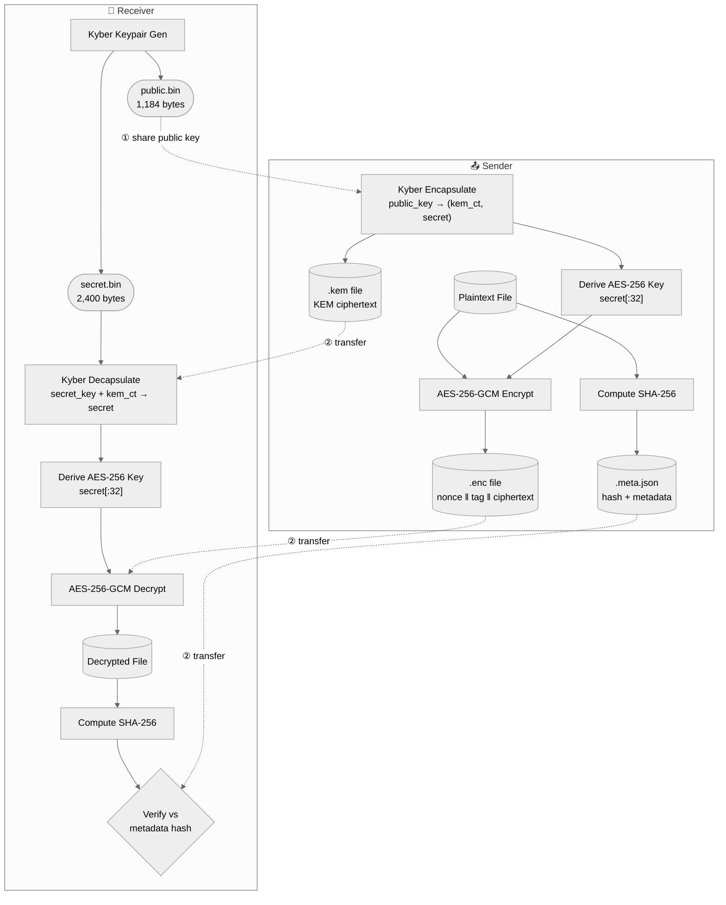
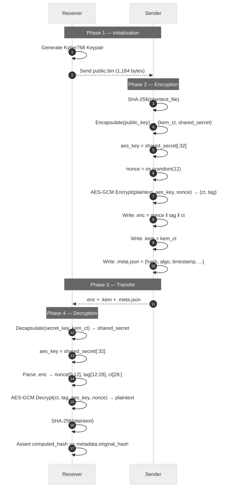

<div align="center">
  
# 📘 Pangolin — Technical Documentation

**Full technical reference for the Pangolin post-quantum secure file transfer proof-of-concept.**

*A deep dive into the cryptographic architecture, mathematical foundations, and security implications of hybrid post-quantum systems.*

[Why Post-Quantum?](#-why-post-quantum) • [Cryptographic Stack](#%EF%B8%8F-cryptographic-stack) • [Architecture](#%EF%B8%8F-architecture) • [Usage](#-usage-reference) • [Formats](#-how-it-works) • [Benchmarking](#%EF%B8%8F-benchmarking)
</div>

---

## 🎓 Why Post-Quantum?

Classical public-key cryptography (RSA, ECDH) derives its security from problems like integer factorization and discrete logarithms. A sufficiently powerful quantum computer running **Shor's Algorithm** can solve both in polynomial time.

```text
RSA-2048   ──►  Broken by Shor's Algorithm
ECDH P-256 ──►  Broken by Shor's Algorithm

Kyber768   ──►  Based on Module-LWE — no known quantum speedup
```

**CRYSTALS-Kyber768** is grounded in the **Module Learning With Errors (Module-LWE)** problem. In 2024, NIST standardized it as **FIPS 203 (ML-KEM)** — the first post-quantum KEM to receive full federal standardization.

> ⚠️ **"Store Now, Decrypt Later"** 
> Adversaries are harvesting encrypted traffic today to decrypt once quantum hardware matures. Post-quantum migration must start now.

---

## 📐 Mathematical Concepts

This project serves as an interactive proof-of-concept for core concepts in **Post-Quantum Cryptography** and **Information Security**:

| Concept | Demonstration |
| :--- | :--- |
| **Module-LWE** | The underlying hardness assumption of Kyber, based on the difficulty of solving systems of linear equations over rings with added noise. |
| **Key Encapsulation** | Asymmetric generation of a symmetric shared secret without ever transmitting the secret itself across the wire. |
| **Galois/Counter Mode** | Authenticated encryption that mathematically guarantees both message confidentiality and integrity in a single pass. |
| **Hash Functions** | One-way cryptographic algorithms (SHA-256) used here as a tamper-evident seal for the plaintext data. |
| **Hybrid Cryptography** | The protocol pattern of using computationally expensive asymmetric math (Kyber) only for key exchange, and fast symmetric math (AES) for bulk data. |

---

## 🛡️ Cryptographic Stack

Pangolin uses a **hybrid encryption** model: the post-quantum KEM establishes a shared secret; AES uses that secret for bulk encryption. This mirrors the pattern of TLS 1.3.

### CRYSTALS-Kyber768

| Parameter | Value |
| :--- | :--- |
| **Type** | Key Encapsulation Mechanism (KEM) |
| **Standard** | FIPS 203 (ML-KEM) — NIST PQC winner |
| **Security basis** | Module Learning With Errors (Module-LWE) |
| **Security level** | NIST Level 3 (~AES-192 classical equivalent) |
| **Public key size** | 1,184 bytes |
| **Secret key size** | 2,400 bytes |
| **KEM ciphertext**| 1,088 bytes |
| **Shared secret** | 32 bytes |

### AES-256-GCM

| Parameter | Value |
| :--- | :--- |
| **Key size** | 256 bits (32 bytes) |
| **Nonce size** | 96 bits (12 bytes) — NIST recommended |
| **Tag size** | 128 bits (16 bytes) |
| **Mode** | Galois/Counter Mode — authenticated encryption (AEAD) |

GCM provides both **confidentiality** and **integrity** in one pass. Any modification to the ciphertext — even a single bit — causes tag verification to fail before decryption.

### SHA-256

| Parameter | Value |
| :--- | :--- |
| **Digest size** | 256 bits — 64-character hex string |
| **File hashing**| Streaming, 64 KB chunks (supports arbitrarily large files) |
| **Usage** | Hash computed pre-encryption, embedded in metadata, verified post-decryption |

---

## 🏗️ Architecture

### High-Level Workflow



### Cryptographic Sequence



---

## 📖 Usage Reference

### `receiver/keygen.py`

Generates a Kyber768 keypair.

```bash
python receiver/keygen.py [--out-dir DIR]
```

| Output file | Size | Notes |
| :--- | :--- | :--- |
| `keys/public.bin` | 1,184 bytes | Share with sender |
| `keys/secret.bin` | 2,400 bytes | Never share — keep locally |

### `sender/encrypt.py`

Encrypts a file using the receiver's public key.

```bash
python sender/encrypt.py --file FILE --pubkey PUBKEY [--out-dir DIR]
```

| Output file | Description |
| :--- | :--- |
| `<name>.enc` | Encrypted payload: `nonce(12B) ‖ tag(16B) ‖ ciphertext(NB)` |
| `<name>.kem` | Kyber KEM ciphertext (1,088 bytes) |
| `<name>.meta.json` | Metadata: original hash, algorithm, timestamps |

### `receiver/decrypt.py`

Decrypts a received package and verifies file integrity.

```bash
python receiver/decrypt.py --enc-file FILE --seckey KEY [--out-dir DIR]
```

> 💡 **Note**: The `.kem` and `.meta.json` files are inferred automatically from the `.enc` path. All three must be in the same directory.

---

## 🔍 How It Works

### The `.enc` Binary Format

```text
Offset    Size      Field
──────────────────────────────────────────────────────
0         12 bytes  AES-GCM nonce (random, per-file)
12        16 bytes  AES-GCM authentication tag
28        N bytes   Ciphertext (same length as plaintext)
```

### The `.meta.json` Format

```json
{
  "filename": "document.pdf",
  "filesize": 1048576,
  "algorithm": "Kyber768 + AES-256-GCM",
  "original_hash": "a3f1c2b4d5e6f7a8...",
  "timestamp": "2026-06-24T16:00:00+00:00",
  "version": "1.0",
  "nonce_size": 12,
  "tag_size": 16,
  "ciphertext_size": 1048576,
  "kem_ciphertext_size": 1088
}
```

### AES Key Derivation

Kyber768 produces exactly 32 bytes of uniformly random shared secret — the exact size of an AES-256 key. Pangolin maps it directly:

```python
def derive_aes_key(shared_secret: bytes) -> bytes:
    return shared_secret[:32]
```

> **In production:** Apply HKDF-SHA256 for domain separation and key hygiene.

---

## 📦 Module Reference

### `core/kyber.py` — Kyber768 KEM
| Function | Returns | Description |
| :--- | :--- | :--- |
| `generate_keypair()` | `(bytes, bytes)` | Generate keypair: `(public_key, secret_key)` |
| `encapsulate(public_key)` | `(bytes, bytes)` | Returns `(kem_ciphertext, shared_secret)` |
| `decapsulate(secret_key, ciphertext)` | `bytes` | Recover `shared_secret` from KEM ciphertext |

### `core/aes.py` — AES-256-GCM
| Function | Returns | Description |
| :--- | :--- | :--- |
| `derive_aes_key(shared_secret)` | `bytes` | First 32 bytes of shared secret |
| `encrypt_file(filepath, key)` | `(nonce, ciphertext, tag)` | Reads file, encrypts, returns components |
| `decrypt_file(nonce, ciphertext, tag, key)` | `bytes` | Verifies tag, returns plaintext. Raises `InvalidTag` on failure |

### `core/integrity.py` — SHA-256
| Function | Returns | Description |
| :--- | :--- | :--- |
| `compute_hash(filepath)` | `str` | Streaming SHA-256 of a file (64 KB chunks) |
| `verify_hash(filepath, expected)` | `bool` | Hash file and compare |

---

## ⏱️ Benchmarking

```bash
python -c "
import sys; sys.path.insert(0, 'receiver')
from core.benchmark import run_full_benchmark, print_summary, save_results

results = run_full_benchmark(
    file_sizes=[1024, 102400, 1048576, 10485760],
    iterations=5
)
print_summary(results)
"
```

**Sample output:**

```text
================================================================================
BENCHMARK SUMMARY
================================================================================
File Size    Operation            Avg (ms)   Min (ms)   Max (ms)   CPU %  RAM MB
--------------------------------------------------------------------------------
1 KB         key_generation          0.421      0.398      0.451     0.0   42.13
1 KB         encapsulation           0.187      0.181      0.196     0.0   42.15
1 KB         encryption              0.051      0.048      0.056     0.0   42.16
1 KB         decapsulation           0.203      0.198      0.209     0.0   42.17
1 KB         decryption              0.045      0.042      0.049     0.0   42.18

10 MB        key_generation          0.418      0.401      0.443     0.0   44.82
10 MB        encapsulation           0.191      0.183      0.201     0.0   44.84
10 MB        encryption             12.843     12.201     13.842     4.2   52.64
10 MB        decapsulation           0.205      0.196      0.217     0.0   52.66
10 MB        decryption             11.922     11.588     12.411     3.8   52.71
================================================================================
```

---

## 🔒 Security Notes

> ⚠️ **IMPORTANT**
> This is a proof-of-concept. The following simplifications exist by design and must be resolved before any production deployment.

### Simplifications vs. Production

| Simplification | Production Recommendation |
| :--- | :--- |
| AES key = raw Kyber shared secret | Apply HKDF-SHA256 with context/domain label |
| File fully loaded into memory | Streaming GCM encryption with chunked processing |
| Transfer via file copy | Secure transport layer (TLS 1.3 with PQ KEM) |
| No sender authentication | Post-quantum digital signature (ML-DSA / Dilithium) |
| Keys stored as raw binary | HSM or encrypted key store |
| No key rotation / expiry | Key lifecycle management |
| No replay protection | Session nonces or timestamps |

### What Is Correctly Implemented

- ✅ **Quantum-resistant key exchange** — Kyber768 is NIST FIPS 203 standardized
- ✅ **Authenticated encryption** — AES-256-GCM detects any ciphertext tampering
- ✅ **End-to-end integrity** — SHA-256 verified post-decryption catches corruption
- ✅ **Nonce uniqueness** — `os.urandom(12)` per encryption operation
- ✅ **Secret key isolation** — secret key never leaves the receiver's workspace

---

<div align="center">
  <i>Open-source and built for educational purposes.</i>
</div>
