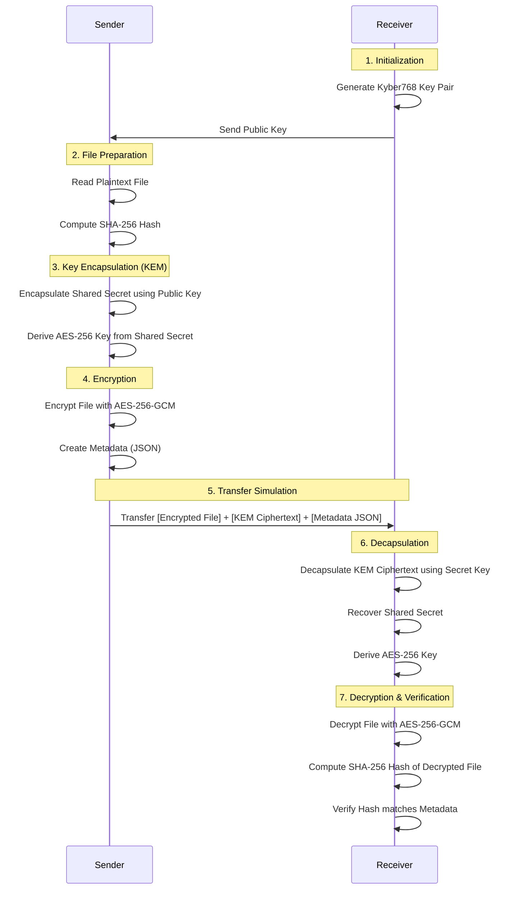

# Pangolin — Post-Quantum Cryptography Proof-of-Concept
A Python-based proof-of-concept demonstrating secure file transfer using **post-quantum cryptography**.
## Overview
Pangolin demonstrates a complete secure file transfer workflow using:
| Component | Technology | Purpose |
|-----------|-----------|---------|
| Key Encapsulation | **CRYSTALS-Kyber768** | Post-quantum key exchange |
| Symmetric Encryption | **AES-256-GCM** | Authenticated file encryption |
| Integrity Verification | **SHA-256** | File hash comparison |
| Transfer Simulation | **shutil.copy** | Folder-to-folder file copying |
## Requirements
- Python 3.11+
- [liboqs](https://github.com/open-quantum-safe/liboqs) (native C library)
## Installation
### 1. Install liboqs (native library)
**Ubuntu/Debian:**
```bash
sudo apt install cmake gcc ninja-build libssl-dev
git clone --depth 1 https://github.com/open-quantum-safe/liboqs.git
cd liboqs && mkdir build && cd build
cmake -GNinja .. && ninja && sudo ninja install
sudo ldconfig
```
**macOS (Homebrew):**
```bash
brew install cmake ninja openssl
git clone --depth 1 https://github.com/open-quantum-safe/liboqs.git
cd liboqs && mkdir build && cd build
cmake -GNinja .. && ninja && sudo ninja install
```
### 2. Install Python dependencies
```bash
pip install -r requirements.txt
```
## Usage
### Run Demo (with generated sample file)
```bash
python main.py
```
### Encrypt a Specific File
```bash
python main.py --file path/to/document.pdf
```
### Run Performance Benchmarks
```bash
python main.py --benchmark
```
### Both Demo and Benchmarks
```bash
python main.py --file document.pdf --benchmark
```
### Options
```
--file, -f          Path to file to encrypt and transfer
--benchmark, -b     Run performance benchmarks
--sample-size       Size of generated sample file in bytes (default: 102400)
--log-level         Logging level: DEBUG, INFO, WARNING, ERROR (default: INFO)
```
## How It Works

The secure file transfer process is divided into sender and receiver roles. The system utilizes a hybrid cryptographic approach, combining the post-quantum security of Kyber768 with the high performance of AES-256-GCM.

### Cryptographic Flow



### Module Responsibilities

The application is modularized into several key components:

- **`main.py`**: The CLI entry point. It orchestrates the entire workflow outlined above, acting as the controller for both the sender and receiver roles.
- **`pangolin/kyber.py`**: Wraps the `liboqs-python` library. Handles the generation of post-quantum key pairs, and the encapsulation/decapsulation of the shared secret.
- **`pangolin/aes.py`**: Utilizes the `cryptography` library. Derives the AES key from the Kyber shared secret and performs the symmetric encryption/decryption of the file payload using AES-256-GCM.
- **`pangolin/integrity.py`**: Manages SHA-256 hash computation for both streaming large files and verifying byte data. Ensures the file remains unaltered during transit.
- **`pangolin/metadata.py`**: Generates and manages JSON metadata files that accompany the encrypted payload. This includes file details, original hashes, and algorithm tags.
- **`pangolin/transfer.py`**: Simulates the network transfer by copying the final encrypted package (ciphertext, KEM ciphertext, and metadata) to the receiver's directory.
- **`pangolin/benchmark.py`**: (Optional) Measures timing, CPU, and RAM usage for each cryptographic operation, allowing performance evaluation across different file sizes.
- **`pangolin/logger.py`**: Provides centralized console and file logging to trace execution events.

## Project Structure

```text
pangolin/
├── pangolin/               # Core package
│   ├── __init__.py         # Package metadata
│   ├── kyber.py            # Kyber768 KEM wrapper
│   ├── aes.py              # AES-256-GCM encrypt/decrypt
│   ├── integrity.py        # SHA-256 hashing & verification
│   ├── transfer.py         # Simulated file transfer
│   ├── benchmark.py        # Performance measurement
│   ├── metadata.py         # JSON metadata management
│   └── logger.py           # Logging configuration
├── main.py                 # CLI entry point
├── requirements.txt        # Python dependencies
├── data/
│   ├── sender/             # Input files (plaintext)
│   ├── encrypted/          # Encrypted output + metadata
│   └── receiver/           # Received & decrypted files
└── README.md               # This file
```
## Dependencies
| Package | Version | Purpose |
|---------|---------|---------|
| `cryptography` | latest | AES-256-GCM encryption |
| `liboqs-python` | latest | Kyber768 KEM bindings |
| `psutil` | latest | CPU/RAM monitoring |
## Algorithm Details
### CRYSTALS-Kyber768
- **Type:** Key Encapsulation Mechanism (KEM)
- **Security Level:** NIST Level 3
- **Public Key Size:** 1,184 bytes
- **Ciphertext Size:** 1,088 bytes
- **Shared Secret Size:** 32 bytes
- **Standard:** FIPS 203 (ML-KEM)
### AES-256-GCM
- **Key Size:** 256 bits
- **Nonce Size:** 96 bits (12 bytes)
- **Tag Size:** 128 bits (16 bytes)
- **Mode:** Galois/Counter Mode (authenticated encryption)
### SHA-256
- **Digest Size:** 256 bits (32 bytes)
- **Output Format:** 64-character hexadecimal string
## License
Research and educational use.