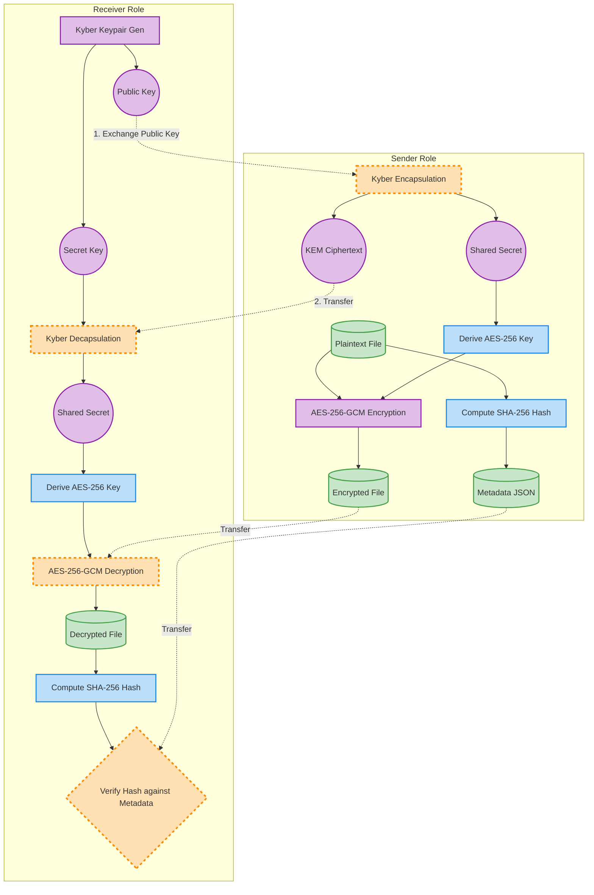
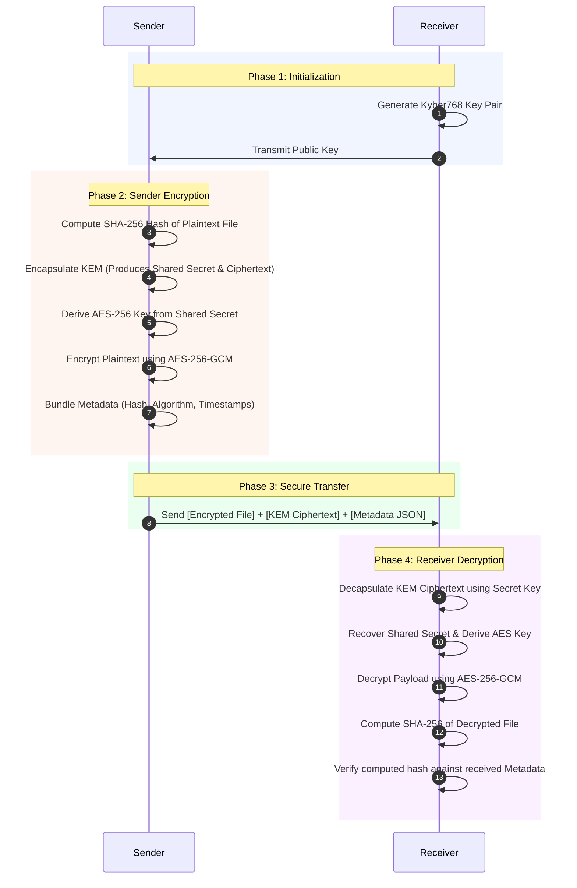

# Pangolin — Post-Quantum Cryptography Proof-of-Concept
A Python-based proof-of-concept demonstrating secure file transfer using **post-quantum cryptography**.
## Overview
Pangolin demonstrates a complete secure file transfer workflow using:
| Component | Technology | Purpose |
|-----------|-----------|---------|
| Key Encapsulation | **CRYSTALS-Kyber768** | Post-quantum key exchange |
| Symmetric Encryption | **AES-256-GCM** | Authenticated file encryption |
| Integrity Verification | **SHA-256** | File hash comparison |
| Transfer Simulation | **shutil.copy** | Folder-to-folder file copying |
## Requirements
- Python 3.11+
- [liboqs](https://github.com/open-quantum-safe/liboqs) (native C library)
## Installation
### 1. Install liboqs (native library)
**Ubuntu/Debian:**
```bash
sudo apt install cmake gcc ninja-build libssl-dev
git clone --depth 1 https://github.com/open-quantum-safe/liboqs.git
cd liboqs && mkdir build && cd build
cmake -GNinja .. && ninja && sudo ninja install
sudo ldconfig
```
**macOS (Homebrew):**
```bash
brew install cmake ninja openssl
git clone --depth 1 https://github.com/open-quantum-safe/liboqs.git
cd liboqs && mkdir build && cd build
cmake -GNinja .. && ninja && sudo ninja install
```
### 2. Install Python dependencies
```bash
pip install -r requirements.txt
```
## Usage

This project is separated into `sender` and `receiver` directories to simulate a real-world file transfer between two distinct parties.

### 1. Receiver: Generate Keys
The receiver generates a post-quantum key pair and sends the public key to the sender.
```bash
python receiver/keygen.py
# Generates: receiver/keys/public.bin and receiver/keys/secret.bin
```

### 2. Sender: Encrypt File
The sender uses the receiver's public key to encrypt a file.
```bash
# Assuming the receiver's public.bin was copied to sender/public_keys/
python sender/encrypt.py \
    --file "sender/data/Pride and Prejudice (1813).pdf" \
    --pubkey "sender/public_keys/public.bin"
# Generates: .enc, .kem, and .meta.json files in sender/data/encrypted/
```

### 3. Receiver: Decrypt File
The receiver takes the encrypted files sent by the sender and decrypts them using their secret key.
```bash
# Assuming the encrypted files were copied to receiver/data/received/
python receiver/decrypt.py \
    --enc-file "receiver/data/received/Pride and Prejudice (1813).pdf.enc" \
    --seckey "receiver/keys/secret.bin"
# Generates: decrypted file in receiver/data/decrypted/
```
## How It Works

The secure file transfer process is divided into sender and receiver roles. The system utilizes a hybrid cryptographic approach, combining the post-quantum security of Kyber768 with the high performance of AES-256-GCM.

### High-Level Work Flow

The diagram below illustrates how data and cryptographic keys move through the system, from the initial file to the verified decryption.



### Detailed Cryptographic Sequence

This sequence diagram breaks down the precise order of operations during a file transfer session.



### Module Responsibilities

The application is modularized into several key components:

- **`main.py`**: The CLI entry point. It orchestrates the entire workflow outlined above, acting as the controller for both the sender and receiver roles.
- **`pangolin/kyber.py`**: Wraps the `liboqs-python` library. Handles the generation of post-quantum key pairs, and the encapsulation/decapsulation of the shared secret.
- **`pangolin/aes.py`**: Utilizes the `cryptography` library. Derives the AES key from the Kyber shared secret and performs the symmetric encryption/decryption of the file payload using AES-256-GCM.
- **`pangolin/integrity.py`**: Manages SHA-256 hash computation for both streaming large files and verifying byte data. Ensures the file remains unaltered during transit.
- **`pangolin/metadata.py`**: Generates and manages JSON metadata files that accompany the encrypted payload. This includes file details, original hashes, and algorithm tags.
- **`pangolin/transfer.py`**: Simulates the network transfer by copying the final encrypted package (ciphertext, KEM ciphertext, and metadata) to the receiver's directory.
- **`pangolin/benchmark.py`**: (Optional) Measures timing, CPU, and RAM usage for each cryptographic operation, allowing performance evaluation across different file sizes.
- **`pangolin/logger.py`**: Provides centralized console and file logging to trace execution events.

## Project Structure

```text
pangolin/
├── pangolin/               # Shared core cryptography library
│   ├── __init__.py
│   ├── kyber.py
│   ├── aes.py
│   ├── integrity.py
│   ├── metadata.py
│   ├── logger.py
│   └── benchmark.py
│
├── receiver/               # RECEIVER'S WORKSPACE
│   ├── tools/
│   │   ├── keygen.py       # Generates Kyber768 keys
│   │   └── decrypt.py      # Decrypts received packages
│   ├── keys/               # Stores private & public keys
│   └── data/               # Stores received & decrypted files
│
├── sender/                 # SENDER'S WORKSPACE
│   ├── tools/
│   │   └── encrypt.py      # Encrypts files using receiver's public key
│   ├── public_keys/        # Stores public keys received from others
│   └── data/               # Stores files to send & encrypted packages
└── README.md
```

## Dependencies
| Package | Version | Purpose |
|---------|---------|---------|
| `cryptography` | latest | AES-256-GCM encryption |
| `liboqs-python` | latest | Kyber768 KEM bindings |
| `psutil` | latest | CPU/RAM monitoring |
## Algorithm Details
### CRYSTALS-Kyber768
- **Type:** Key Encapsulation Mechanism (KEM)
- **Security Level:** NIST Level 3
- **Public Key Size:** 1,184 bytes
- **Ciphertext Size:** 1,088 bytes
- **Shared Secret Size:** 32 bytes
- **Standard:** FIPS 203 (ML-KEM)
### AES-256-GCM
- **Key Size:** 256 bits
- **Nonce Size:** 96 bits (12 bytes)
- **Tag Size:** 128 bits (16 bytes)
- **Mode:** Galois/Counter Mode (authenticated encryption)
### SHA-256
- **Digest Size:** 256 bits (32 bytes)
- **Output Format:** 64-character hexadecimal string
## License
Research and educational use.