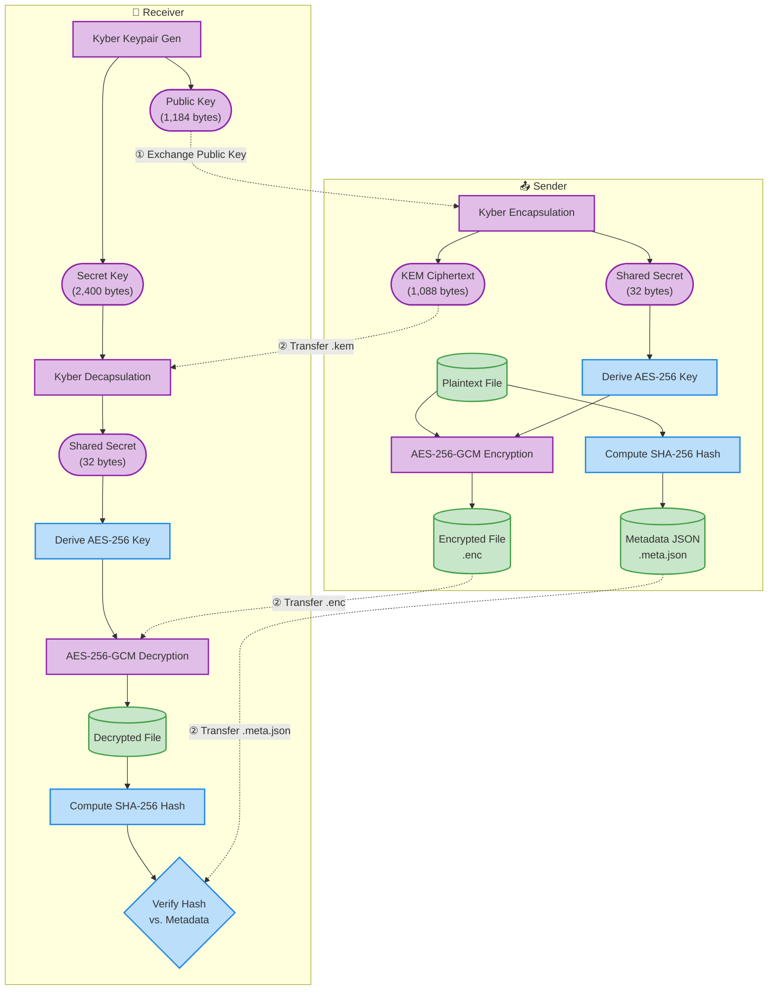
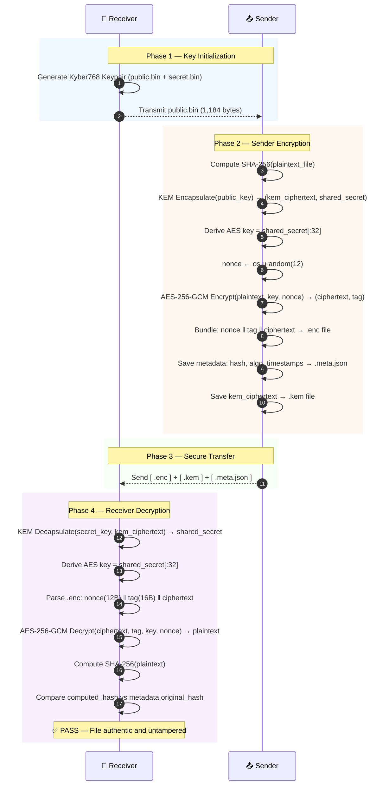

<div align="center">

<br/>

```
██████╗  █████╗ ███╗   ██╗ ██████╗  ██████╗ ██╗     ██╗███╗   ██╗
██╔══██╗██╔══██╗████╗  ██║██╔════╝ ██╔═══██╗██║     ██║████╗  ██║
██████╔╝███████║██╔██╗ ██║██║  ███╗██║   ██║██║     ██║██╔██╗ ██║
██╔═══╝ ██╔══██║██║╚██╗██║██║   ██║██║   ██║██║     ██║██║╚██╗██║
██║     ██║  ██║██║ ╚████║╚██████╔╝╚██████╔╝███████╗██║██║ ╚████║
╚═╝     ╚═╝  ╚═╝╚═╝  ╚═══╝ ╚═════╝  ╚═════╝ ╚══════╝╚═╝╚═╝  ╚═══╝
```

**Post-Quantum Secure File Transfer — Proof of Concept**

*Defending against tomorrow's quantum computers, today.*

<br/>

[](https://www.python.org/)
[](https://csrc.nist.gov/pubs/fips/203/final)
[](https://openquantumsafe.org/)
[]()
[]()

</div>

---

## ◈ Table of Contents

- [Overview](#-overview)
- [Why Post-Quantum?](#-why-post-quantum)
- [Cryptographic Stack](#-cryptographic-stack)
- [Architecture](#-architecture)
- [Project Structure](#-project-structure)
- [Installation](#-installation)
- [Quick Start](#-quick-start)
- [Usage Reference](#-usage-reference)
- [How It Works](#-how-it-works)
- [Module Reference](#-module-reference)
- [Benchmarking](#-benchmarking)
- [Security Notes](#-security-notes)
- [Dependencies](#-dependencies)
- [License](#-license)

---

## ◈ Overview

**Pangolin** is a Python-based proof-of-concept that demonstrates a complete, end-to-end secure file transfer system using **post-quantum cryptography**. It is built around the NIST-standardized **CRYSTALS-Kyber768** Key Encapsulation Mechanism (KEM) combined with **AES-256-GCM** symmetric cipher in a classical **hybrid encryption** model.

The project is intentionally structured to simulate a real-world two-party communication scenario, with physically separated **Sender** and **Receiver** workspaces, mimicking how cryptographic keys and encrypted artifacts would travel between two distinct machines.

> **Goal:** Demonstrate that post-quantum key exchange can be integrated cleanly with classical authenticated encryption to produce a system that is resistant to both classical and quantum adversaries.

### At a Glance

| Property | Detail |
|---|---|
| **Version** | `0.1.0` |
| **Language** | Python 3.11+ |
| **Quantum-Safe KEM** | CRYSTALS-Kyber768 (FIPS 203 / ML-KEM) |
| **Symmetric Cipher** | AES-256-GCM (Authenticated Encryption) |
| **Integrity Check** | SHA-256 |
| **Transfer Simulation** | Folder-to-folder file copy |
| **Benchmarking** | Timing, CPU %, RAM usage (via `psutil`) |

---

## ◈ Why Post-Quantum?

Classical public-key cryptography — such as RSA and Elliptic Curve Diffie-Hellman (ECDH) — derives its security from the computational hardness of problems like **integer factorization** and **discrete logarithms**.

A sufficiently powerful **quantum computer**, running **Shor's Algorithm**, can solve these problems in polynomial time — effectively breaking all widely-deployed key exchange protocols today.

```
Classical Threat Model:
  RSA-2048   ──────────►  Broken by Shor's Algorithm (quantum)
  ECDH P-256 ──────────►  Broken by Shor's Algorithm (quantum)

Post-Quantum Solution:
  Kyber768   ──────────►  Based on Module-LWE (quantum-resistant)
```

**CRYSTALS-Kyber768** is based on the **Module Learning With Errors (Module-LWE)** problem, which has no known efficient quantum algorithm. In 2024, NIST officially standardized it as **FIPS 203 (ML-KEM)**, making it the first post-quantum KEM to receive full federal standardization.

> **"Store Now, Decrypt Later"** — Adversaries today are harvesting encrypted traffic to decrypt once quantum computers become viable. Systems must be quantum-safe *now*.

---

## ◈ Cryptographic Stack

Pangolin uses a **hybrid cryptographic model**: the post-quantum KEM handles the key exchange problem, while the battle-tested AES symmetric cipher handles bulk data encryption.

### CRYSTALS-Kyber768

| Parameter | Value |
|---|---|
| **Type** | Key Encapsulation Mechanism (KEM) |
| **Standard** | FIPS 203 (ML-KEM), NIST PQC Round 4 Winner |
| **Security Basis** | Module Learning With Errors (Module-LWE) |
| **Security Level** | NIST Level 3 (~AES-192 classical equivalent) |
| **Public Key Size** | 1,184 bytes |
| **Secret Key Size** | 2,400 bytes |
| **KEM Ciphertext Size** | 1,088 bytes |
| **Shared Secret Size** | 32 bytes |

### AES-256-GCM

| Parameter | Value |
|---|---|
| **Key Size** | 256 bits (32 bytes) |
| **Nonce Size** | 96 bits (12 bytes) — NIST recommended |
| **Tag Size** | 128 bits (16 bytes) |
| **Mode** | Galois/Counter Mode (GCM) |
| **Property** | Authenticated Encryption with Associated Data (AEAD) |

> **Why AES-256-GCM?** GCM mode provides both **confidentiality** (encryption) and **integrity** (authentication tag) in a single pass, eliminating the need for a separate MAC. This makes it impossible for an attacker to tamper with the ciphertext without detection — even without knowing the key.

### SHA-256

| Parameter | Value |
|---|---|
| **Digest Size** | 256 bits (32 bytes) |
| **Output** | 64-character hexadecimal string |
| **Usage** | Pre-encryption plaintext hash stored in metadata; verified post-decryption |
| **Streaming** | Chunk-based (64 KB buffer) — handles arbitrarily large files |

### Hybrid Encryption: Why Both?

The key insight: **KEM algorithms are not bulk encryption algorithms.** They are only used to securely agree on a shared secret key. That key is then used with a fast symmetric cipher (AES) to encrypt the actual data. This is the same pattern used in TLS 1.3.

```
Kyber768 KEM  ──►  Shared Secret (32 bytes)  ──►  AES-256 Key  ──►  Encrypt File
     ▲                                                                      │
     │                                                                      ▼
Receiver's Public Key                                             Encrypted Output
```

---

## ◈ Architecture

### High-Level Workflow



### Cryptographic Sequence Diagram



---

## ◈ Project Structure

```
pangolin/
│
├── 📄 README.md
├── 📄 requirements.txt
│
├── 📦 receiver/                    ← Receiver's isolated workspace
│   ├── keygen.py                   # CLI: Generate Kyber768 keypair
│   ├── decrypt.py                  # CLI: Decrypt received package
│   │
│   └── core/                       # Shared cryptographic library
│       ├── __init__.py             # Package metadata (v0.1.0)
│       ├── kyber.py                # Kyber768 KEM wrapper (liboqs)
│       ├── aes.py                  # AES-256-GCM encrypt/decrypt
│       ├── integrity.py            # SHA-256 hash & verification
│       ├── metadata.py             # JSON metadata creation & loading
│       ├── logger.py               # Centralized logging (console + file)
│       └── benchmark.py            # Performance benchmarking suite
│
└── 📦 sender/                      ← Sender's isolated workspace
    ├── encrypt.py                  # CLI: Encrypt file for receiver
    │
    └── core/                       # Shared cryptographic library (mirror)
        ├── __init__.py
        ├── kyber.py
        ├── aes.py
        ├── integrity.py
        ├── metadata.py
        ├── logger.py
        └── benchmark.py
```

> **Design Note:** The `sender/` and `receiver/` directories are intentionally **isolated workspaces** — each with their own `core/` library copy. This models the real-world scenario where two parties run the software independently on separate machines, with no shared filesystem access.

---

## ◈ Installation

### Prerequisites

- **Python 3.11+**
- **CMake**, **Ninja**, **GCC/Clang**, **OpenSSL headers** (for building `liboqs`)

### Step 1 — Build & Install liboqs (C Library)

`liboqs` is the underlying C library from the [Open Quantum Safe](https://openquantumsafe.org/) project that implements Kyber768.

**Ubuntu / Debian:**

```bash
# Install build dependencies
sudo apt update
sudo apt install -y cmake gcc ninja-build libssl-dev

# Clone and build liboqs
git clone --depth 1 https://github.com/open-quantum-safe/liboqs.git
cd liboqs
mkdir build && cd build
cmake -GNinja ..
ninja
sudo ninja install
sudo ldconfig
```

**macOS (Homebrew):**

```bash
# Install build dependencies
brew install cmake ninja openssl

# Clone and build liboqs
git clone --depth 1 https://github.com/open-quantum-safe/liboqs.git
cd liboqs
mkdir build && cd build
cmake -GNinja -DOPENSSL_ROOT_DIR=$(brew --prefix openssl) ..
ninja
sudo ninja install
```

**Verify installation:**
```bash
ls /usr/local/lib | grep oqs   # Should show liboqs.so or liboqs.dylib
```

### Step 2 — Install Python Dependencies

```bash
# Clone the repository
git clone https://github.com/your-username/pangolin.git
cd pangolin

# (Recommended) Create a virtual environment
python3 -m venv .venv
source .venv/bin/activate

# Install dependencies
pip install -r requirements.txt
```

**`requirements.txt`:**
```
cryptography      # AES-256-GCM, key primitives
liboqs-python     # Python bindings for liboqs (Kyber768)
psutil            # CPU and RAM monitoring for benchmarks
```

---

## ◈ Quick Start

A complete walkthrough from key generation to successful decryption.

```bash
# ─────────────────────────────────────────────────────
#  STEP 1: Receiver generates a Kyber768 keypair
# ─────────────────────────────────────────────────────
python receiver/keygen.py

# Output:
# ============================================================
#   RECEIVER: Generating Kyber768 Key Pair
# ============================================================
# [!] IMPORTANT:
#     Send 'receiver/keys/public.bin' to the Sender.
#     Keep 'receiver/keys/secret.bin' safe and secret.

# ─────────────────────────────────────────────────────
#  STEP 2: Receiver shares the public key with Sender
# ─────────────────────────────────────────────────────
cp receiver/keys/public.bin sender/public_keys/public.bin

# ─────────────────────────────────────────────────────
#  STEP 3: Sender encrypts a file
# ─────────────────────────────────────────────────────
python sender/encrypt.py \
    --file "sender/data/document.pdf" \
    --pubkey "sender/public_keys/public.bin"

# Output:
# ============================================================
#   SENDER: Encrypting File
# ============================================================
# [!] TRANSFER REQUIRED:
#     Send the following files to the Receiver:
#       1. document.pdf.enc
#       2. document.pdf.kem
#       3. document.pdf.meta.json

# ─────────────────────────────────────────────────────
#  STEP 4: Transfer encrypted package to Receiver
# ─────────────────────────────────────────────────────
cp sender/data/encrypted/document.pdf.* receiver/data/received/

# ─────────────────────────────────────────────────────
#  STEP 5: Receiver decrypts the file
# ─────────────────────────────────────────────────────
python receiver/decrypt.py \
    --enc-file "receiver/data/received/document.pdf.enc" \
    --seckey "receiver/keys/secret.bin"

# Output:
# ============================================================
#   RECEIVER: Decrypting File
# ============================================================
# ------------------------------------------------------------
#   ✅ Integrity Verification PASSED: File is authentic and untampered.
# ------------------------------------------------------------
```

---

## ◈ Usage Reference

### `receiver/keygen.py` — Key Generation

Generates a Kyber768 keypair and saves both keys to disk.

```
usage: keygen.py [-h] [--out-dir OUT_DIR]

optional arguments:
  --out-dir OUT_DIR   Output directory for keys (default: keys/)
```

**Output files:**

| File | Size | Description |
|---|---|---|
| `keys/public.bin` | 1,184 bytes | Public key — safe to share with Sender |
| `keys/secret.bin` | 2,400 bytes | Secret key — **never share this** |

**Example:**
```bash
python receiver/keygen.py --out-dir my_keys/
```

---

### `sender/encrypt.py` — File Encryption

Encrypts a file using the Receiver's public key. Produces three output files that must all be transferred to the Receiver.

```
usage: encrypt.py [-h] --file FILE --pubkey PUBKEY [--out-dir OUT_DIR]

required arguments:
  --file FILE         Path to the plaintext file to encrypt
  --pubkey PUBKEY     Path to the Receiver's public key (public.bin)

optional arguments:
  --out-dir OUT_DIR   Output directory (default: data/encrypted/)
```

**Output files:**

| File | Description |
|---|---|
| `<filename>.enc` | Encrypted payload: `nonce(12B) ‖ tag(16B) ‖ ciphertext` |
| `<filename>.kem` | KEM ciphertext (1,088 bytes) — needed to recover the AES key |
| `<filename>.meta.json` | Metadata: original hash, algorithm, timestamp, sizes |

**Example:**
```bash
python sender/encrypt.py \
    --file "sender/data/report.pdf" \
    --pubkey "sender/public_keys/public.bin" \
    --out-dir "sender/data/encrypted/"
```

---

### `receiver/decrypt.py` — File Decryption

Decrypts a received package using the Receiver's secret key and verifies file integrity.

```
usage: decrypt.py [-h] --enc-file ENC_FILE --seckey SECKEY [--out-dir OUT_DIR]

required arguments:
  --enc-file ENC_FILE  Path to the encrypted file (.enc)
  --seckey SECKEY      Path to your secret key (secret.bin)

optional arguments:
  --out-dir OUT_DIR    Output directory (default: data/decrypted/)
```

> **Note:** `decrypt.py` automatically infers the `.kem` and `.meta.json` paths from the `.enc` file path. All three files must reside in the same directory.

**Example:**
```bash
python receiver/decrypt.py \
    --enc-file "receiver/data/received/report.pdf.enc" \
    --seckey "receiver/keys/secret.bin" \
    --out-dir "receiver/data/decrypted/"
```

---

## ◈ How It Works

### The Metadata Bundle (`.meta.json`)

Every encrypted package is accompanied by a structured JSON metadata file:

```json
{
  "filename": "document.pdf",
  "filesize": 1048576,
  "algorithm": "Kyber768 + AES-256-GCM",
  "original_hash": "a3f1c2b4d5e6f7a8b9c0d1e2f3a4b5c6d7e8f9a0b1c2d3e4f5a6b7c8d9e0f1a2",
  "timestamp": "2026-06-24T16:00:00+00:00",
  "version": "1.0",
  "nonce_size": 12,
  "tag_size": 16,
  "ciphertext_size": 1048576,
  "kem_ciphertext_size": 1088
}
```

### The `.enc` File Format

The encrypted payload is a simple binary concatenation:

```
┌──────────────┬──────────────────┬────────────────────────────────────────────┐
│  Nonce (12B) │  GCM Tag (16B)   │  Ciphertext (N bytes — same size as input) │
└──────────────┴──────────────────┴────────────────────────────────────────────┘
 [0:12]         [12:28]            [28:]
```

The receiver parses:
- `received_data[:12]` → nonce
- `received_data[12:28]` → authentication tag
- `received_data[28:]` → ciphertext

### AES Key Derivation

The Kyber768 shared secret is exactly **32 bytes** — the precise size of an AES-256 key. Pangolin uses a **direct mapping**: the shared secret is used as the AES key without additional KDF steps, since Kyber's shared secret is already uniformly random.

```python
# core/aes.py
def derive_aes_key(shared_secret: bytes) -> bytes:
    return shared_secret[:32]  # Kyber768 produces exactly 32 uniform bytes
```

> In a production system, a proper KDF (e.g., HKDF-SHA256) should be applied for domain separation and key stretching hygiene.

---

## ◈ Module Reference

### `core/kyber.py` — Kyber768 KEM

Wraps the `liboqs-python` bindings for CRYSTALS-Kyber768. All functions include timing instrumentation via `time.perf_counter()`.

| Function | Signature | Description |
|---|---|---|
| `generate_keypair` | `() → (bytes, bytes)` | Generate a new Kyber768 keypair `(public_key, secret_key)` |
| `encapsulate` | `(public_key: bytes) → (bytes, bytes)` | Returns `(kem_ciphertext, shared_secret)` |
| `decapsulate` | `(secret_key: bytes, ciphertext: bytes) → bytes` | Recovers `shared_secret` from KEM ciphertext |

---

### `core/aes.py` — AES-256-GCM

Provides authenticated symmetric encryption using the `cryptography` library's `AESGCM` primitive.

| Function | Signature | Description |
|---|---|---|
| `derive_aes_key` | `(shared_secret: bytes) → bytes` | Extract 32-byte AES key from Kyber shared secret |
| `encrypt_file` | `(filepath, key) → (nonce, ciphertext, tag)` | Read and encrypt a file; returns nonce + split ciphertext/tag |
| `decrypt_file` | `(nonce, ciphertext, tag, key) → bytes` | Verify GCM tag and decrypt; raises `InvalidTag` on failure |

---

### `core/integrity.py` — SHA-256

Streaming and in-memory hash computation and comparison for file integrity verification.

| Function | Signature | Description |
|---|---|---|
| `compute_hash` | `(filepath) → str` | Streaming SHA-256 of a file (64 KB chunks) |
| `compute_hash_bytes` | `(data: bytes) → str` | SHA-256 of raw bytes in memory |
| `verify_hash` | `(filepath, expected: str) → bool` | Hash file and compare to expected digest |
| `verify_hash_bytes` | `(data: bytes, expected: str) → bool` | Hash bytes and compare to expected digest |

---

### `core/metadata.py` — JSON Metadata

Manages the structured metadata bundle that accompanies each encrypted package.

| Function | Signature | Description |
|---|---|---|
| `create_metadata` | `(filename, filesize, algorithm, original_hash, extra) → dict` | Build metadata dict with UTC ISO timestamp |
| `save_metadata` | `(metadata, filepath) → None` | Serialize metadata to a pretty-printed JSON file |
| `load_metadata` | `(filepath) → dict` | Read and deserialize JSON metadata file |

---

### `core/logger.py` — Logging

Centralized dual-output logging — console and rotating log file.

```python
from core.logger import setup_logger, get_logger

# Setup once at the CLI entry point
logger = setup_logger("sender", log_file="sender.log")

# Retrieve the configured logger in any submodule
logger = get_logger()
logger.info("Encryption complete")
logger.warning("File hash mismatch detected!")
```

---

### `core/benchmark.py` — Performance Benchmarking

A complete benchmarking suite that executes the full Pangolin encrypt/decrypt workflow across configurable file sizes and iterations, collecting wall-clock time, CPU %, and RAM usage for each operation.

**`BenchmarkResult` dataclass:**

| Field | Type | Description |
|---|---|---|
| `operation` | `str` | Human-readable operation name |
| `duration_ms` | `float` | Wall-clock time in milliseconds |
| `cpu_percent` | `float` | Process CPU % post-operation |
| `ram_mb` | `float` | Process RSS memory in megabytes |
| `file_size_bytes` | `int` | File size being processed |

---

## ◈ Benchmarking

Run the full benchmark suite directly from a sender or receiver directory:

```bash
cd pangolin

python -c "
import sys
sys.path.insert(0, 'receiver')
from core.benchmark import run_full_benchmark, print_summary, save_results

results = run_full_benchmark(
    file_sizes=[1*1024, 100*1024, 1*1024*1024, 10*1024*1024],
    iterations=5
)
print_summary(results)
save_results(results, 'benchmark_results.json')
"
```

The benchmark performs **7 operations** per iteration per file size:

| # | Operation | Description |
|---|---|---|
| 1 | **Key Generation** | Kyber768 keypair creation |
| 2 | **KEM Encapsulation** | Shared secret + ciphertext generation |
| 3 | **AES Key Derivation** | `shared_secret[:32]` |
| 4 | **AES-256-GCM Encryption** | Full file encryption |
| 5 | **SHA-256 Hashing** | Integrity hash computation |
| 6 | **KEM Decapsulation** | Shared secret recovery |
| 7 | **AES-256-GCM Decryption** | Full file decryption + tag verification |

**Sample output:**

```
================================================================================
BENCHMARK SUMMARY
================================================================================
File Size    Operation            Avg (ms)   Min (ms)   Max (ms)   CPU %  RAM MB
--------------------------------------------------------------------------------
1 KB         key_generation          0.421      0.398      0.451     0.0   42.13
1 KB         encapsulation           0.187      0.181      0.196     0.0   42.15
1 KB         encryption              0.051      0.048      0.056     0.0   42.16
1 KB         hash_computation        0.012      0.011      0.014     0.0   42.16
1 KB         decapsulation           0.203      0.198      0.209     0.0   42.17
1 KB         decryption              0.045      0.042      0.049     0.0   42.18

10 MB        key_generation          0.418      0.401      0.443     0.0   44.82
10 MB        encapsulation           0.191      0.183      0.201     0.0   44.84
10 MB        encryption             12.843     12.201     13.842     4.2   52.64
10 MB        hash_computation        8.213      7.891      8.604     2.1   52.65
10 MB        decapsulation           0.205      0.196      0.217     0.0   52.66
10 MB        decryption             11.922     11.588     12.411     3.8   52.71
================================================================================
```

> Note: KEM operations (key generation, encapsulation, decapsulation) are nearly **constant-time** regardless of file size, confirming that Kyber768 overhead is negligible. AES and SHA-256 operations scale linearly with file size.

---

## ◈ Security Notes

> [!IMPORTANT]
> **This is a proof-of-concept for educational and research purposes.** The following design choices were made for simplicity and should be addressed before any production use.

### Current Simplifications vs. Production Recommendations

| Simplification | Production Recommendation |
|---|---|
| AES key = raw Kyber shared secret | Apply **HKDF-SHA256** with context/domain separation string |
| Entire file loaded into memory | Implement **streaming GCM encryption** with chunked processing |
| Transfer simulated via `shutil.copy` | Use a proper **secure transport layer** (e.g., TLS 1.3 with PQ KEX) |
| No sender authentication | Add a **post-quantum digital signature** (e.g., ML-DSA / Dilithium) |
| Keys stored as raw binary files | Use a **HSM**, key store, or at minimum encrypted key file |
| No key rotation or expiry | Implement **key lifecycle management** with rotation policy |
| No protection against replay attacks | Add **session nonces** or timestamps to prevent replay |

### What IS Secure (As Implemented)

- ✅ **Quantum-resistant key exchange** — Kyber768 is NIST FIPS 203 standardized
- ✅ **Authenticated encryption** — AES-256-GCM detects any ciphertext tampering via the GCM tag
- ✅ **End-to-end integrity** — SHA-256 hash verified post-decryption catches file corruption
- ✅ **Nonce uniqueness** — Nonce generated via `os.urandom(12)` per encryption operation (statistically unique)
- ✅ **Secret key isolation** — Secret key never leaves the Receiver's workspace in any transfer

---

## ◈ Dependencies

| Package | Version | Purpose |
|---|---|---|
| [`cryptography`](https://cryptography.io/) | latest | AES-256-GCM authenticated encryption |
| [`liboqs-python`](https://github.com/open-quantum-safe/liboqs-python) | latest | Kyber768 KEM Python bindings |
| [`psutil`](https://psutil.readthedocs.io/) | latest | CPU/RAM monitoring for benchmarks |

**Native dependency (must be installed separately):**

| Library | Purpose |
|---|---|
| [`liboqs`](https://github.com/open-quantum-safe/liboqs) | C implementation of post-quantum algorithms (OQS project) |

---

## ◈ License

This project is intended for **research and educational use only**.

It demonstrates the practical application of NIST-standardized post-quantum cryptographic primitives (FIPS 203 / ML-KEM) in a real-world file transfer scenario. It is not production software.

---

<div align="center">

**Pangolin** — *Because even your files deserve quantum armor.*

<br/>

Built with the [Open Quantum Safe](https://openquantumsafe.org/) project &nbsp;·&nbsp; NIST [FIPS 203](https://csrc.nist.gov/pubs/fips/203/final) (ML-KEM)

</div>
