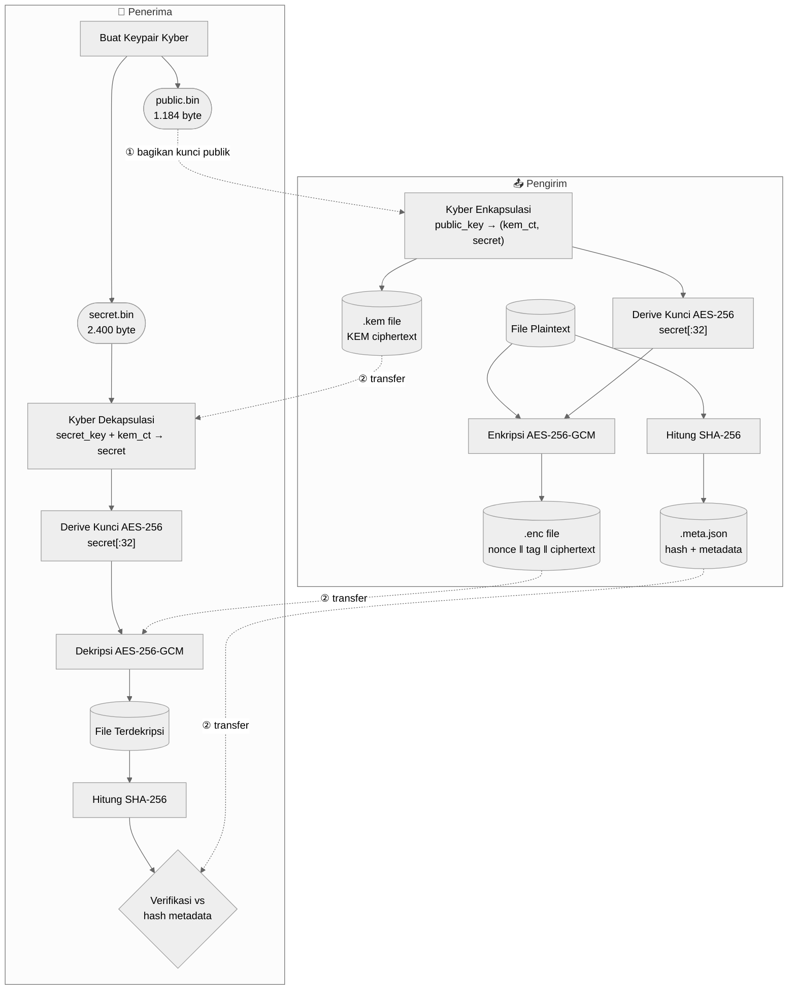
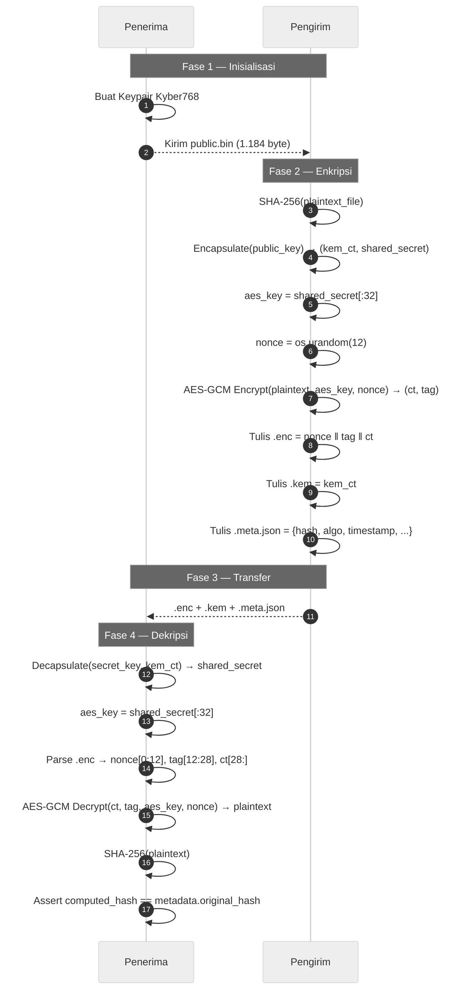

<div align="center">
  
# 📘 Pangolin — Dokumentasi Teknis

**Referensi teknis lengkap untuk proof-of-concept transfer file aman post-kuantum Pangolin.**

*Penjelasan mendalam tentang arsitektur kriptografi, fondasi matematika, dan implikasi keamanan dari sistem hybrid post-kuantum.*

[Mengapa Post-Kuantum?](#-mengapa-post-kuantum) • [Stack Kriptografi](#%EF%B8%8F-stack-kriptografi) • [Arsitektur](#%EF%B8%8F-arsitektur) • [Penggunaan](#-referensi-penggunaan) • [Format](#-cara-kerja) • [Benchmarking](#%EF%B8%8F-benchmarking)
</div>

---

## 🎓 Mengapa Post-Kuantum?

Kriptografi kunci publik klasik (RSA, ECDH) mengandalkan keamanan dari masalah seperti faktorisasi bilangan bulat dan logaritma diskrit. Komputer kuantum yang cukup kuat yang menjalankan **Algoritma Shor** dapat menyelesaikan keduanya dalam waktu polinomial.

```text
RSA-2048   ──►  Dipatahkan oleh Algoritma Shor
ECDH P-256 ──►  Dipatahkan oleh Algoritma Shor

Kyber768   ──►  Berdasarkan Module-LWE — tidak ada percepatan kuantum yang diketahui
```

**CRYSTALS-Kyber768** didasarkan pada masalah **Module Learning With Errors (Module-LWE)**. Pada tahun 2024, NIST menstandarisasikannya sebagai **FIPS 203 (ML-KEM)** — KEM post-kuantum pertama yang menerima standarisasi federal penuh.

> ⚠️ **"Store Now, Decrypt Later"**  
> Musuh sedang mengumpulkan lalu lintas terenkripsi saat ini untuk didekripsi setelah perangkat keras kuantum matang. Migrasi post-kuantum harus dimulai sekarang.

---

## 📐 Konsep Matematika

Proyek ini berfungsi sebagai proof-of-concept interaktif untuk konsep inti dalam **Kriptografi Post-Kuantum** dan **Keamanan Informasi**:

| Konsep | Demonstrasi |
| :--- | :--- |
| **Module-LWE** | Asumsi kekerasan yang mendasari Kyber, berdasarkan sulitnya menyelesaikan sistem persamaan linear atas ring dengan noise tambahan. |
| **Key Encapsulation** | Pembuatan asimetris dari rahasia bersama simetris tanpa pernah mengirimkan rahasia itu sendiri melalui jaringan. |
| **Galois/Counter Mode** | Enkripsi terotentikasi yang menjamin secara matematis baik kerahasiaan maupun integritas pesan dalam satu kali proses. |
| **Fungsi Hash** | Algoritma kriptografi satu arah (SHA-256) yang digunakan di sini sebagai segel tahan-tamper untuk data plaintext. |
| **Kriptografi Hybrid** | Pola protokol yang menggunakan matematika asimetris yang mahal secara komputasi (Kyber) hanya untuk pertukaran kunci, dan matematika simetris yang cepat (AES) untuk enkripsi data massal. |

---

## 🛡️ Stack Kriptografi

Pangolin menggunakan model **enkripsi hybrid**: KEM post-kuantum membangun rahasia bersama; AES menggunakan rahasia itu untuk enkripsi massal. Ini mencerminkan pola TLS 1.3.

### CRYSTALS-Kyber768

| Parameter | Nilai |
| :--- | :--- |
| **Tipe** | Key Encapsulation Mechanism (KEM) |
| **Standar** | FIPS 203 (ML-KEM) — pemenang NIST PQC |
| **Dasar keamanan** | Module Learning With Errors (Module-LWE) |
| **Tingkat keamanan** | NIST Level 3 (~setara AES-192 klasik) |
| **Ukuran kunci publik** | 1.184 byte |
| **Ukuran kunci rahasia** | 2.400 byte |
| **KEM ciphertext** | 1.088 byte |
| **Shared secret** | 32 byte |

### AES-256-GCM

| Parameter | Nilai |
| :--- | :--- |
| **Ukuran kunci** | 256 bit (32 byte) |
| **Ukuran nonce** | 96 bit (12 byte) — rekomendasi NIST |
| **Ukuran tag** | 128 bit (16 byte) |
| **Mode** | Galois/Counter Mode — enkripsi terotentikasi (AEAD) |

GCM menyediakan **kerahasiaan** dan **integritas** dalam satu kali proses. Modifikasi apapun pada ciphertext — bahkan satu bit — menyebabkan verifikasi tag gagal sebelum dekripsi.

### SHA-256

| Parameter | Nilai |
| :--- | :--- |
| **Ukuran digest** | 256 bit — string hex 64 karakter |
| **Hashing file** | Streaming, potongan 64 KB (mendukung file berukuran berapapun) |
| **Penggunaan** | Hash dihitung pra-enkripsi, disematkan dalam metadata, diverifikasi pasca-dekripsi |

---

## 🏗️ Arsitektur

### Alur Kerja Tingkat Tinggi



### Urutan Kriptografi



---

## 📖 Referensi Penggunaan

### `receiver/keygen.py`

Membuat keypair Kyber768.

```bash
python receiver/keygen.py [--out-dir DIR]
```

| File output | Ukuran | Catatan |
| :--- | :--- | :--- |
| `keys/public.bin` | 1.184 byte | Bagikan ke pengirim |
| `keys/secret.bin` | 2.400 byte | Jangan pernah dibagikan — simpan secara lokal |

### `sender/encrypt.py`

Mengenkripsi file menggunakan kunci publik penerima.

```bash
python sender/encrypt.py --file FILE --pubkey PUBKEY [--out-dir DIR]
```

| File output | Deskripsi |
| :--- | :--- |
| `<nama>.enc` | Payload terenkripsi: `nonce(12B) ‖ tag(16B) ‖ ciphertext(NB)` |
| `<nama>.kem` | KEM ciphertext Kyber (1.088 byte) |
| `<nama>.meta.json` | Metadata: hash asli, algoritma, timestamp |

### `receiver/decrypt.py`

Mendekripsi paket yang diterima dan memverifikasi integritas file.

```bash
python receiver/decrypt.py --enc-file FILE --seckey KEY [--out-dir DIR]
```

> 💡 **Catatan**: File `.kem` dan `.meta.json` disimpulkan secara otomatis dari path `.enc`. Ketiganya harus berada dalam direktori yang sama.

---

## 🔍 Cara Kerja

### Format Biner `.enc`

```text
Offset    Ukuran    Field
──────────────────────────────────────────────────────
0         12 byte   AES-GCM nonce (acak, per-file)
12        16 byte   Tag autentikasi AES-GCM
28        N byte    Ciphertext (panjang sama dengan plaintext)
```

### Format `.meta.json`

```json
{
  "filename": "document.pdf",
  "filesize": 1048576,
  "algorithm": "Kyber768 + AES-256-GCM",
  "original_hash": "a3f1c2b4d5e6f7a8...",
  "timestamp": "2026-06-24T16:00:00+00:00",
  "version": "1.0",
  "nonce_size": 12,
  "tag_size": 16,
  "ciphertext_size": 1048576,
  "kem_ciphertext_size": 1088
}
```

### Derivasi Kunci AES

Kyber768 menghasilkan tepat 32 byte shared secret yang seragam secara acak — ukuran yang tepat untuk kunci AES-256. Pangolin memetakannya secara langsung:

```python
def derive_aes_key(shared_secret: bytes) -> bytes:
    return shared_secret[:32]
```

> **Untuk produksi:** Terapkan HKDF-SHA256 untuk pemisahan domain dan kebersihan kunci.

---

## 📦 Referensi Modul

### `core/kyber.py` — Kyber768 KEM
| Fungsi | Kembalian | Deskripsi |
| :--- | :--- | :--- |
| `generate_keypair()` | `(bytes, bytes)` | Buat keypair: `(public_key, secret_key)` |
| `encapsulate(public_key)` | `(bytes, bytes)` | Mengembalikan `(kem_ciphertext, shared_secret)` |
| `decapsulate(secret_key, ciphertext)` | `bytes` | Pulihkan `shared_secret` dari KEM ciphertext |

### `core/aes.py` — AES-256-GCM
| Fungsi | Kembalian | Deskripsi |
| :--- | :--- | :--- |
| `derive_aes_key(shared_secret)` | `bytes` | 32 byte pertama dari shared secret |
| `encrypt_file(filepath, key)` | `(nonce, ciphertext, tag)` | Membaca file, mengenkripsi, mengembalikan komponen |
| `decrypt_file(nonce, ciphertext, tag, key)` | `bytes` | Memverifikasi tag, mengembalikan plaintext. Melempar `InvalidTag` jika gagal |

### `core/integrity.py` — SHA-256
| Fungsi | Kembalian | Deskripsi |
| :--- | :--- | :--- |
| `compute_hash(filepath)` | `str` | SHA-256 streaming dari file (potongan 64 KB) |
| `verify_hash(filepath, expected)` | `bool` | Hash file dan bandingkan |

---

## ⏱️ Benchmarking

```bash
python -c "
import sys; sys.path.insert(0, 'receiver')
from core.benchmark import run_full_benchmark, print_summary, save_results

results = run_full_benchmark(
    file_sizes=[1024, 102400, 1048576, 10485760],
    iterations=5
)
print_summary(results)
"
```

**Contoh output:**

```text
================================================================================
BENCHMARK SUMMARY
================================================================================
File Size    Operation            Avg (ms)   Min (ms)   Max (ms)   CPU %  RAM MB
--------------------------------------------------------------------------------
1 KB         key_generation          0.421      0.398      0.451     0.0   42.13
1 KB         encapsulation           0.187      0.181      0.196     0.0   42.15
1 KB         encryption              0.051      0.048      0.056     0.0   42.16
1 KB         decapsulation           0.203      0.198      0.209     0.0   42.17
1 KB         decryption              0.045      0.042      0.049     0.0   42.18

10 MB        key_generation          0.418      0.401      0.443     0.0   44.82
10 MB        encapsulation           0.191      0.183      0.201     0.0   44.84
10 MB        encryption             12.843     12.201     13.842     4.2   52.64
10 MB        decapsulation           0.205      0.196      0.217     0.0   52.66
10 MB        decryption             11.922     11.588     12.411     3.8   52.71
================================================================================
```

---

## 🔒 Catatan Keamanan

> ⚠️ **PENTING**  
> Ini adalah proof-of-concept. Penyederhanaan berikut ada dengan sengaja dan harus diselesaikan sebelum deployment produksi apapun.

### Penyederhanaan vs. Produksi

| Penyederhanaan | Rekomendasi Produksi |
| :--- | :--- |
| Kunci AES = raw shared secret Kyber | Terapkan HKDF-SHA256 dengan label konteks/domain |
| File dimuat penuh ke memori | Enkripsi GCM streaming dengan pemrosesan terpotong |
| Transfer via salinan file | Layer transport aman (TLS 1.3 dengan PQ KEM) |
| Tidak ada autentikasi pengirim | Tanda tangan digital post-kuantum (ML-DSA / Dilithium) |
| Kunci disimpan sebagai biner mentah | HSM atau penyimpanan kunci terenkripsi |
| Tidak ada rotasi / kedaluwarsa kunci | Manajemen siklus hidup kunci |
| Tidak ada proteksi replay | Nonce sesi atau timestamp |

### Yang Diimplementasikan dengan Benar

- ✅ **Pertukaran kunci tahan kuantum** — Kyber768 terstandarisasi NIST FIPS 203
- ✅ **Enkripsi terotentikasi** — AES-256-GCM mendeteksi segala manipulasi ciphertext
- ✅ **Integritas end-to-end** — SHA-256 diverifikasi pasca-dekripsi mendeteksi korupsi
- ✅ **Keunikan nonce** — `os.urandom(12)` per operasi enkripsi
- ✅ **Isolasi kunci rahasia** — kunci rahasia tidak pernah meninggalkan workspace penerima

---

<div align="center">
  <i>Open-source dan dibuat untuk tujuan edukasi.</i>
</div>
